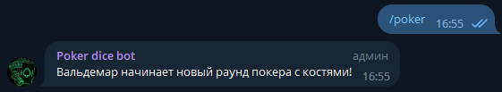
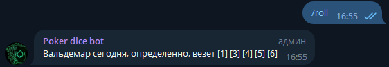
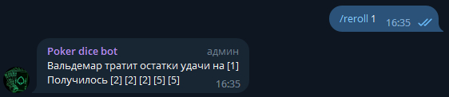
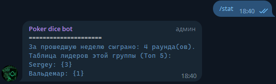

# Poker dice bot for telegram

## Предисловие

Это телеграмм-версия дискорд-бота ([ссылка на гитхаб](https://github.com/ath31st/poker_dice_bot)).
Логика сохранилась, но исполнение изменилось. Дискорд-версия была написана на Java с применением
Spring фреймворка, телеграм-версия - на Kotlin + Exposed.

## О боте

Представьте ситуацию: вы один или еще с кем-нибудь ждете компанию для похода в рейд в мморпг/катки в
доту/матча в кс го/
и так далее, вам уже скучно, актуальные мемы закончились, а баяны кидать еще стыдно... на помощь
приходит простой в освоении
и быстрый покер на костях. Если бот присутствует на канале, то простой командой /poker вы запускаете
раунд и понесло...

## Что умеет

Обеспечивает веселый досуг вам и вашим товарищам, если вам нечем заняться или чего-то/кого-то ждете.
Бот подсчитывает очки, определяет выпавшие комбинации, сохраняет результаты (победителей) в базу
данных, предоставляет статистику по каналу.

## Что не умеет

Не хранит и никуда не передает переписки пользователей

## Список команд

    /poker - служит для запуска раунда
    /roll - бросок костей (5d6)
    /reroll - переброс неудачных костей
    /pass - пропуск переброса, если комбинация не требует изменений
    /finish - досрочное завершение раунда (доступно только начавшему раунд)
    /stat - статистика раундов по текстовому каналу
    /help - описание работы бота, команды

## Примеры работы

Начало раунда: 
 
Бросок костей: 
 
Переброс неподходящих под комбинацию костей: 
 
Вызов статистики по каналу: 
 